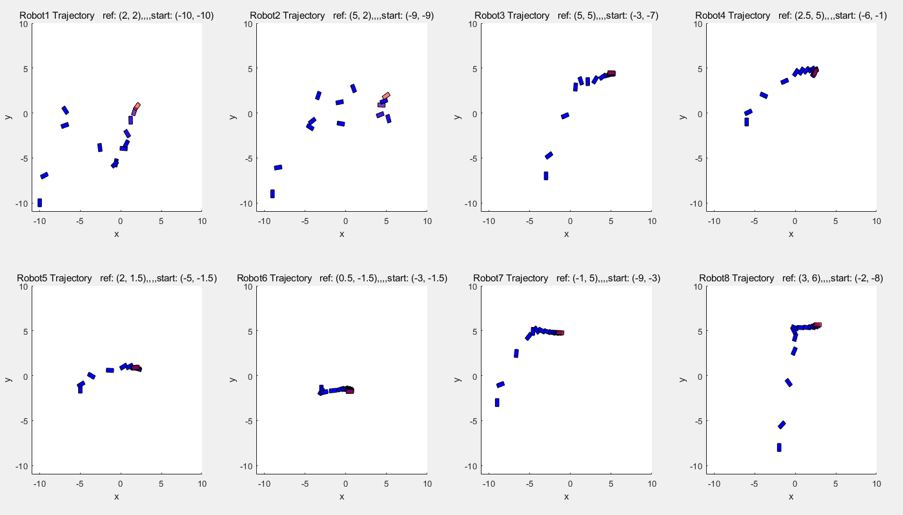
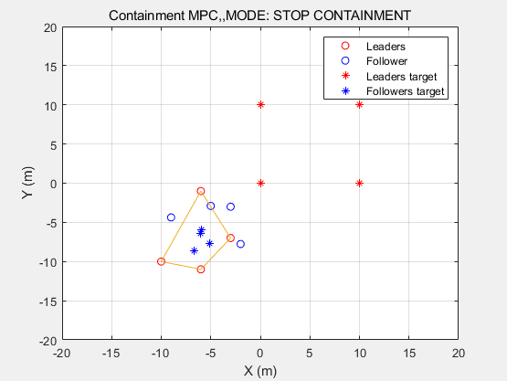
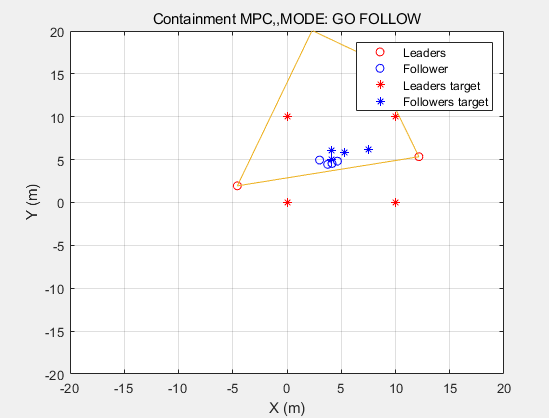

# MPC-simulation

##### paper implementation list

### Require in MPC-simulation directory:
```
git submodule update --init --recursive
```
## * MATLAB
### basic example of MPC
```
matlab run file: simulation_1/mpc_simulation.m
```



### 1. Simulation_1 : A hybrid model predictive control scheme for containment and distributed sensing in multi-agent systems

```
matlab run file: simulation_1/mpc_containment_simulation.m
```




## * ROS
### make sure Requirement.
