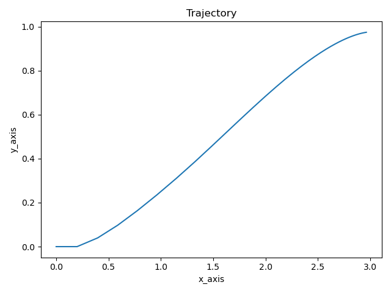
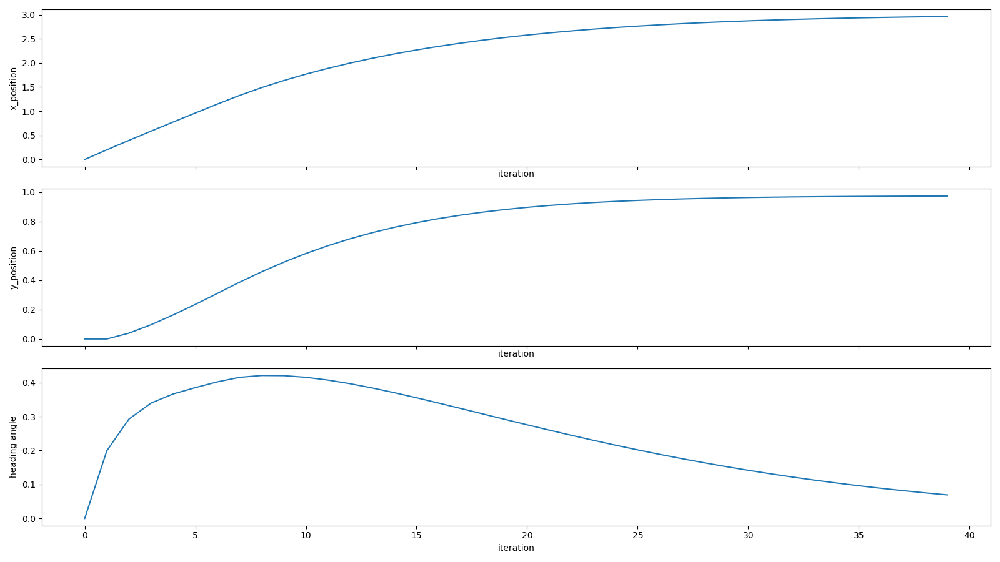
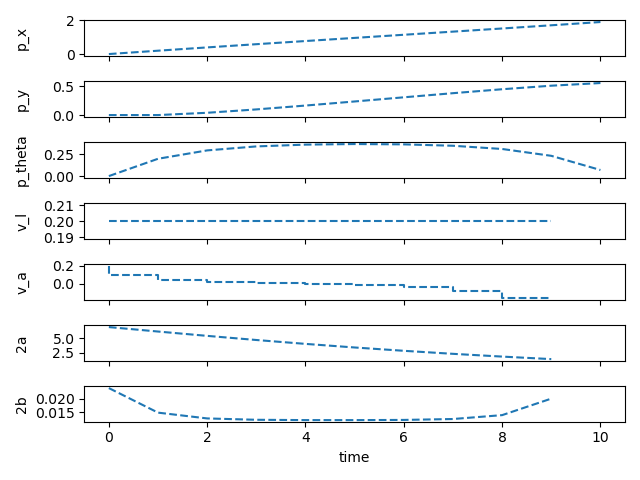

# python3 mpc simulation

## Simulation_0
* Simulation_0 is utilize the [do-mpc](https://github.com/YeongJunKim/do-mpc/tree/8e1e3539b40bb5b546e1bd251896ac34efcbdff5).
* Single robot simulation.

#### Set up this variables
``` python
# In simulation_0_main
dt = 1
init = [0, 0, 0]    # input position
target = [3, 1, 0]  # target position
_u_con = [0.2, 2.0] # constraint of control input [linear velocity, angular velocity]
```
``` python
# In simulation_0_mpc
setup_mpc = {
    'n_horizon': 10, # horizon size
}
```
#### Simulation Result
* 1

* 2

* 3
